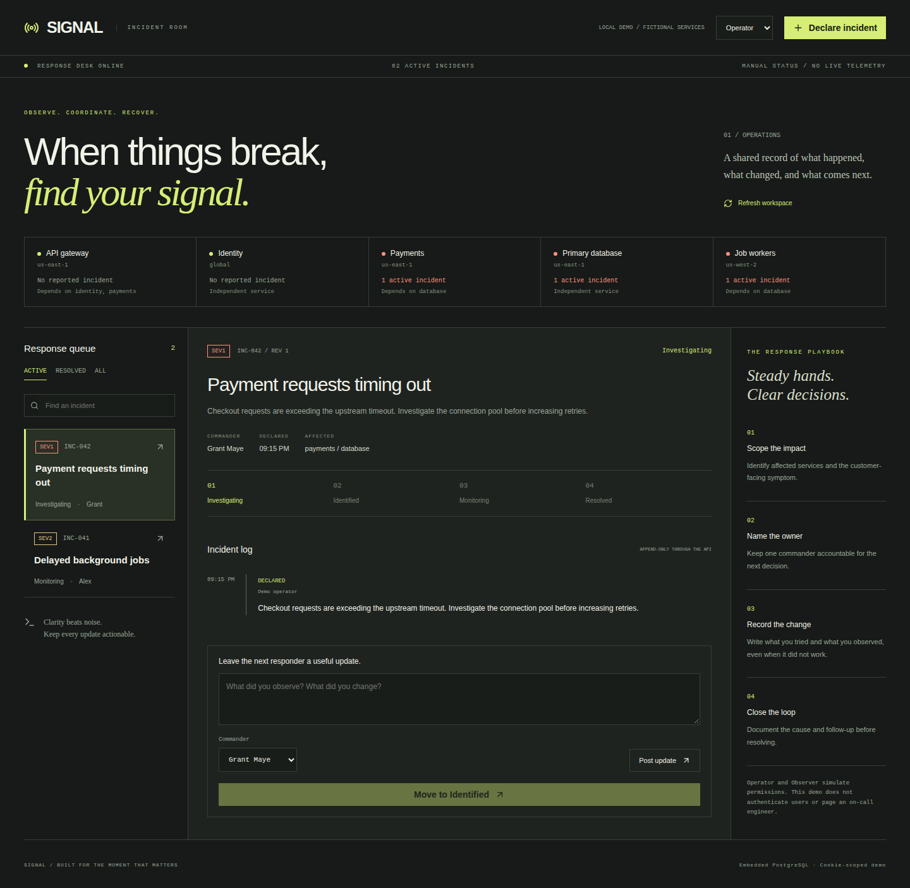

# Signal / Developer Incident Tracker

[](https://github.com/grantmaye/Developer-Incident-Tracker/actions/workflows/ci.yml)

An incident room for declaring impact, coordinating a response, and preserving a useful resolution record. Built with Next.js, TypeScript, Apollo GraphQL, Node.js, and PostgreSQL.

The interface uses a charcoal-and-citron response desk: service status strip, response queue, a central event log, and a contextual playbook. There are no invented uptime percentages or simulated live telemetry. All initial services and incidents are fictional demo records.



## Learn this repository

- [Technical manual](docs/technical-manual.md): architecture, contracts, setup, tests, failure labs, extension exercises with solutions, and interview preparation.
- [Product story](docs/product-story.md): intended users, a hypothetical benefit scenario, limitations, and a 60–90 second demo.

## Run

Node 22.13 or newer:

```sh
npm ci
npm run dev
```

Open http://localhost:3000. PGlite persists data in `.data/signal`. No external account is needed. For external PostgreSQL set DATABASE_URL in `.env.local`. Set APP_ORIGIN to the public origin when hosting behind a reverse proxy. The app requires a Node server; GitHub Pages cannot execute its backend.

## Try it

1. Declare an incident with a title, impact, severity, service, and commander.
2. Add a useful note and move from Investigating to Identified, then Monitoring.
3. Supply a root cause and follow-up before resolving.
4. Reload the page to verify persistence.
5. Open the same incident in two tabs, update one, then try saving the stale version in the other. The second write is rejected and its note stays in the form. Refresh the workspace before retrying.
6. Switch to Observer to see service-enforced read-only behavior.

## Engineering decisions

- GraphQL exposes a typed incident graph and two mutations; business rules live in the service, not the UI.
- Each update locks the incident row and checks the client's expected version. The incident and its new event commit together. This prevents lost updates from stale tabs.
- Stages advance one step at a time. Resolution requires a root cause and follow-up. Resolved records cannot be edited through this API; recurrences become new incidents.
- An incident's timeline is append-only through service methods. It is JSONB stored with the record, not a cryptographically tamper-proof or independently persisted event-sourcing system.
- Cookie-scoped demo workspaces keep sessions separate. The Operator/Observer selector is explicitly a permission simulation, not authentication.
- Limits: 100 incidents per workspace, 200 events per incident, bounded text inputs, and a GraphQL field budget. Fragment definitions are disabled in this small demo.

## Verification

```sh
npm run check
npm run build
npx playwright install chromium
npm run test:e2e
```

CI runs lifecycle and concurrency assertions on both PGlite and PostgreSQL, then desktop and mobile browser workflows. Tests cover stale-write rejection, invalid transitions, resolution requirements, immutable closure, permission checks, and isolation. Browser artifacts include screenshots and failure traces.

## Code map

| File                    | Responsibility                              |
| ----------------------- | ------------------------------------------- |
| src/lib/model.ts        | States, types, sample service catalog       |
| src/lib/service.ts      | Declaration, version checks, atomic updates |
| src/lib/graphql.ts      | Schema, resolvers, API error mapping        |
| src/lib/database.ts     | Embedded and external PostgreSQL adapters   |
| src/components/room.tsx | Interactive response room                   |
| tests/core.test.ts      | Lifecycle and competing-write assertions    |

See [engineering notes](docs/engineering.md) for the implementation walkthrough and interview discussion points.

## Deliberate boundaries

This does not send pages, ingest monitoring alerts, run subscriptions, or authenticate responders. Refresh is manual so a newer server revision never silently replaces an in-progress note. Service status means “has an active reported incident,” not measured health. Dependencies are a reference catalog; the app does not infer downstream impact.

Before production use: verified identities and memberships, real roles, alert ingestion with idempotency keys, incident pagination, normalized audit events, versioned migrations, notification delivery, rate limits, backups, and workspace retention. Initial CREATE IF NOT EXISTS setup is not a versioned migration framework. The unsigned cookie does not establish secure multi-tenancy.

MIT licensed.
